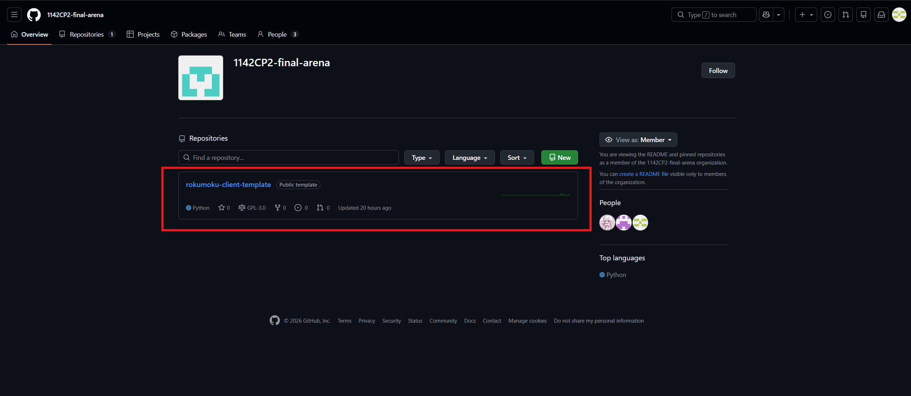
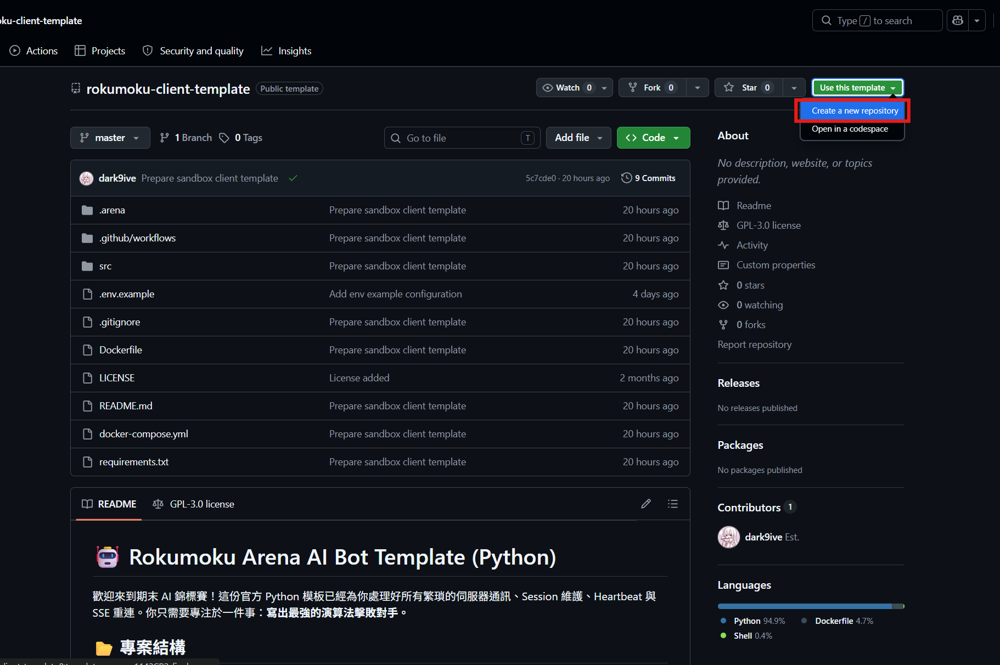
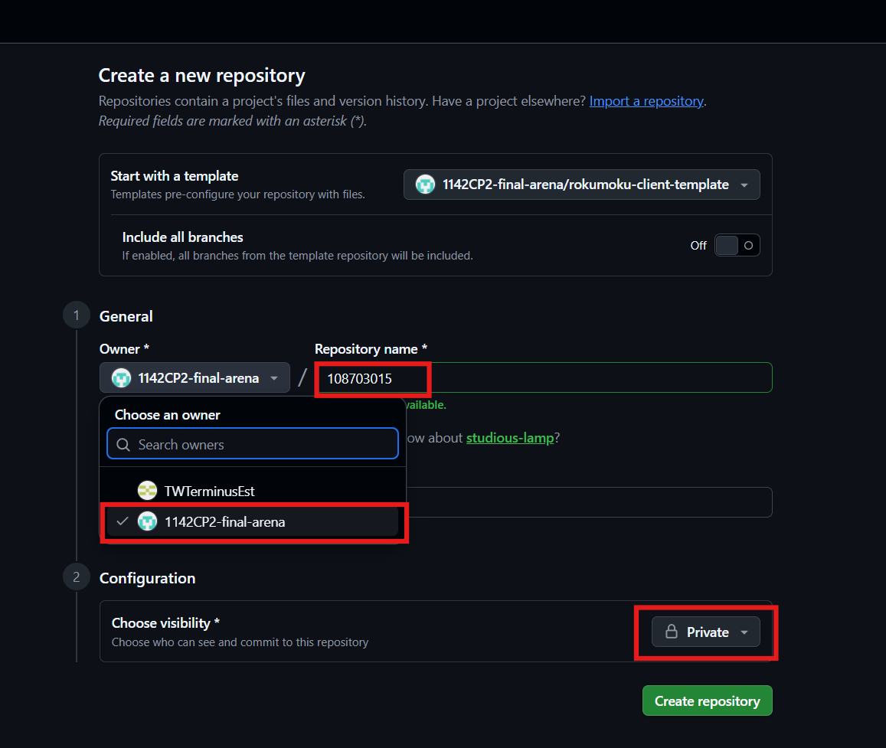
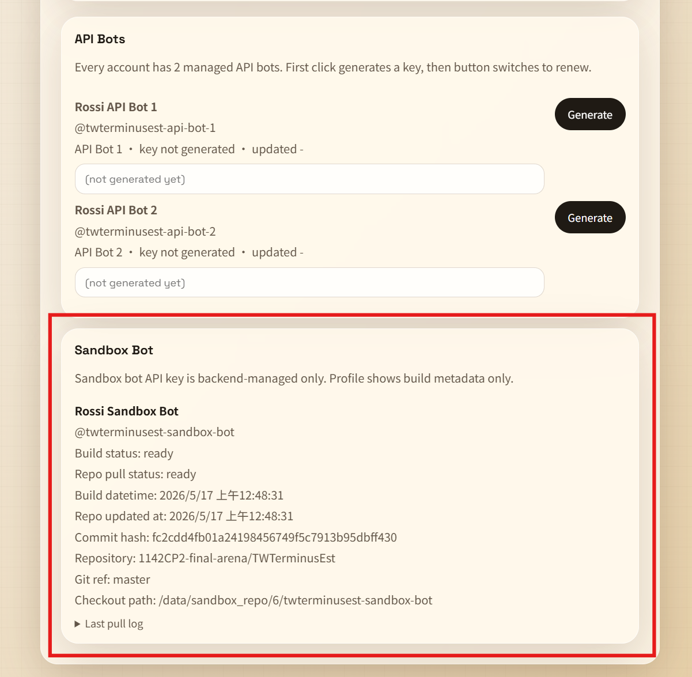

# Rokumoku Arena AI Bot Template

這是期末 AI 錦標賽的官方 Python bot template。模板已處理 Arena API、登入、heartbeat、SSE stream reconnect、上桌、ready、落子與 Armageddon bid 流程；你主要需要實作的是 `src/strategy.py` 裡的 `BotStrategy`。

## 0. How To Use This Template

### Step 1. Create Your Private Repo

請在 class organization 建立自己的 private repository：

https://github.com/1142CP2-final-arena

Repository name 必須使用你的學號，例如：

```text
108703015
```

請勿使用暱稱、隊名、GitHub username 或其他自訂名稱。不遵守命名規則者，助教會在 final report part 酌情扣分。若助教無法辨識 repo 歸屬，助教會直接以 0 分計。

#### Step 1-1. 進入助教提供的 repo template


#### Step 1-2. 點選 "Use this template"


#### Step 1-3. 注意圖上紅框處設定


### Step 2. Clone And Develop

從你的 private repo clone 到本機後，主要修改 `src/strategy.py`。如果你的 AI 需要更多 room snapshot 資訊，也可以閱讀並修改 `src/main.py`，把所需資料傳給 `BotStrategy` 物件或 `choose_move()` / `choose_bid()` 呼叫。

### Step 3. Push To `master`

完成修改後 push 到 `master`。GitHub 會先執行模板提供的 Arena CI；CI 通過後，Arena 會透過 GitHub App webhook 自動登記並 pull 你的 repo。

學生必須先用 GitHub 登入 Arena 一次，Arena 才能用 GitHub workflow actor 的 GitHub id 對應到 Arena user。Repo 命名規則主要供助教評分與人工核對使用，不取代 GitHub OAuth 身分對應。



## 1. Project Structure

```text
client_template/
├── README.md
├── requirements.txt
├── Dockerfile
├── Dockerfile.sandbox-proxy
├── docker-compose.yml
├── docker-compose-sandbox.yml
├── .env.example
├── assets/
│   ├── gh_org_1.png
│   ├── gh_org_2.png
│   ├── gh_org_3.png
│   └── gh_org_4.png
├── .github/
│   └── workflows/
│       └── arena_ci.yml
└── src/
    ├── entrypoint.sh
    ├── test.py
    ├── main.py
    ├── api.py
    └── strategy.py
```

### 可修改

- `src/strategy.py`: 主要開發位置。請在 `BotStrategy` 中實作你的 AI、搜尋、DQN/MCTS 推論或 bid 策略。
- `src/main.py`: 可讀可改。若 AI 需要更多 server snapshot 資訊，可以修改這個檔案，把額外資訊傳給 `BotStrategy`。但不建議改登入、session、heartbeat、SSE reconnect、API command flow，除非你確定後果。

### 不建議修改

- `src/api.py`: 底層 HTTP API wrapper。
- `src/entrypoint.sh`: runtime 入口，通常不需要更改。
- `src/test.py`: startup runtime self-test。Bot 啟動時會先檢查 `/tmp`、Python 套件、Numba cache、Torch CPU inference、`g++` / `make`，通過後才連線 Arena。
- `docker-compose.yml`: 本機 Docker build and run 測試用。
- `docker-compose-sandbox.yml`: 本機 sandbox 模式測試用，會套用網路隔離檢查。
- `assets/`: README 使用的教學截圖，不會被 bot runtime 使用。

### 請勿修改

- `Dockerfile`: 固定 Python 執行環境。正式比賽會使用同等環境。
- `Dockerfile.sandbox-proxy`: sandbox 模式測試用 reverse proxy image；它在 build time 安裝 proxy 需要的工具，避免 runtime 依賴外部 package mirror。
- `requirements.txt`: 固定 Python 套件包。正式比賽不會安裝你額外加入的套件。
- `.github/`: 模板提供的 Arena CI workflow。Arena BE 會檢查 workflow 檔案內容是否和官方模板一致。

## 2. Configure `.env`

複製環境變數範本：

```bash
cp .env.example .env
```

編輯 `.env`：

```dotenv
ARENA_UPSTREAM_URL=http://your-arena-url.com
BOT_API_KEY=ra_bot_YOUR_API_KEY
ROOM_ID=room1
BOT_SEAT=black
```

- `ARENA_UPSTREAM_URL`: Arena base URL。一般 Docker 測試會把它注入為 bot container 內的 `ARENA_URL`；sandbox 測試會讓 nginx proxy 轉發到這個 upstream。
- `BOT_API_KEY`: Arena profile 中的 API Bot Key。
- `ROOM_ID`: 目標房間 ID。
- `BOT_SEAT`: 偏好的初始座位，`black` 或 `white`。

`.env` 內含 API key，請保留在本機，不要 commit。

## 3. Run With Docker

本機 Docker 測試會使用和正式環境相同的固定套件包：

```bash
docker compose up --build --abort-on-container-exit
```

若要啟動 sandbox 模式並執行網路隔離檢查：

```bash
docker compose -f docker-compose-sandbox.yml --profile test up --build --abort-on-container-exit
```

`--profile test` 會啟動額外的 `netcheck` container；檢查完成後整個 compose 會停止。若要讓 sandbox bot 長時間留在房間中測試，請拿掉 `--profile test`。

若要啟動 sandbox 模式並讓 bot 持續執行：

```bash
docker compose -f docker-compose-sandbox.yml up --build
```

`docker-compose.yml` 會：

- build 目前目錄的 `Dockerfile`；
- 讀取 `.env`；
- 將 `./src` 以 read-only 方式掛載到 `/app/src`；
- 在 `/app/src` 執行 `entrypoint.sh`；
- 直接透過 `ARENA_UPSTREAM_URL` 連到 Arena。

本機 sandbox 測試的目標是對齊正式比賽的網路隔離，但具體環境仍可能有差異。請務必 push 到 Arena 系統測試，最終以 Arena backend 實際執行結果為準。

## 4. Sandbox Runtime Contract

正式 sandbox 執行時，請假設：

- project folder 在 container 內是 `/app/src`；
- `/app/src` 是 read-only；
- `entrypoint.sh` 位於 `/app/src/entrypoint.sh`；
- 程式啟動時的 working directory 是 `/app/src`；
- 如果需要暫存檔案，請寫到 `/tmp`；
- `/tmp` 是 tmpfs，容量有限；
- 若需要在啟動時編譯 C++ search engine，請把輸出檔放在 `/tmp`；
- `/dev/shm` 容量有限；
- sandbox bot 只能連 Arena API，不能連外部網路服務。

硬體、sandbox 限制、遊戲規則、Armageddon 規則與 match format 請以 [期末 Project 公告](https://victormftsai.github.io/Class-CP2_1142/finalproj/Final_Score_Distribution.pdf) 為準。

公告中包含 CPU、memory、repository size、`/tmp`、`/dev/shm`、時制與比賽格式等限制。請不要依賴大型暫存檔、外部服務或過慢的模型推論。

## 5. Available Tools

模板固定提供以下工具與套件，正式比賽會使用同等環境。

系統工具：

- `python3`
- `g++`
- `make`

Python 套件：

- `requests`
- `sseclient-py`
- `numpy`
- `scipy`
- `numba`
- `torch` (CPU-only build)
- `gymnasium`
- `tqdm`

若使用 Numba cache，請讓 cache 寫到 `/tmp`。模板已設定 `NUMBA_CACHE_DIR=/tmp/numba_cache`，避免 cache 寫入 read-only 的 `/app/src`。

若使用 C++ search，請在 `src/entrypoint.sh` 或 Python 程式中把 binary 編譯到 `/tmp`，不要輸出到 read-only 的 `/app/src`。

## 6. Implementing `BotStrategy`

你主要需要實作：

```python
class BotStrategy:
    def __init__(self, username):
        ...

    def choose_move(self, board, my_color, strong_available, time_left):
        ...

    def choose_bid(self, my_max_bid, default_color):
        ...
```

### `__init__(username)`

適合初始化模型、lookup table、opening book、MCTS state 或其他可重用資料。若需要 cache，請放在 memory 或 `/tmp`，不要寫入 repo 目錄。

### `choose_move(board, my_color, strong_available, time_left)`

輪到你落子時呼叫。

- `board`: 二維陣列，`.` 代表空格，`b/w` 代表一般黑/白子，`B/W` 代表 strong 黑/白子。
- `my_color`: `1` 是黑，`2` 是白。
- `strong_available`: 目前可用 strong piece 數量。
- `time_left`: 這局剩餘總思考時間，單位秒。

回傳：

```python
row, col, use_strong
```

`row` / `col` 是 zero-based 座標，`use_strong` 是 boolean。

### `choose_bid(my_max_bid, default_color)`

Armageddon bid 時呼叫。

- `my_max_bid`: 最大可出價秒數。
- `default_color`: server 預設顏色。

回傳：

```python
bid_seconds, chosen_color
```

`chosen_color` 必須是 `"black"` 或 `"white"`。

## 7. Automatic Arena Registration

Arena registration 由 GitHub App `workflow_run` webhook 觸發。學生操作流程請看第 0 章；這裡只列系統判定規則。

- 只接受 `master` branch 的 `Arena CI` 結果。
- 只有 CI 成功時，Arena BE 才會處理該 commit。
- Arena BE 會驗證 `.github/workflows/arena_ci.yml` 內容仍和官方模板一致。
- Arena BE 會 checkout 通過 CI 的 exact commit，不會直接 pull branch latest。
- Arena BE pull 前會用 GitHub metadata 做粗略 size 檢查，pull 後會檢查 `src` size。
- 通過後，Profile 的 Sandbox Bot panel 會顯示 ready、commit 與 checkout path。

請不要在 GitHub Actions 或 repo 中保存 Arena API key。Bot API key 只應放在本機 `.env` 或由 Arena sandbox runtime 注入。

## 8. Template And Arena Contract

目前模板對齊以下 Arena behavior：

1. `POST /api/auth/login` 使用 API key 登入，回傳 bot user 資訊。
2. room 狀態以 `/api/rooms/<room_id>/stream` 的 SSE snapshot 為準。
3. template 會定期送 heartbeat。
4. stream 斷線後會自動重連。
5. 落子 API 是 `POST /api/rooms/<room_id>/move`。
6. Armageddon bid API 是 `POST /api/rooms/<room_id>/bid`。
7. server 會提供 `board_compact + board_size`；template 也支援直接使用二維 `board`。

## 9. Practical Tips

- 使用 iterative deepening，隨時保留目前最佳解，避免 timeout。
- 不要每步都花同樣時間；可以在簡單局面快速落子，保留時間給關鍵局面。
- MCTS / DQN 可以使用模板內建套件，但請在 sandbox 限制內控制 CPU、memory、`/tmp` 與推論時間。
- 遊戲規則、Armageddon 規則與 match format 請閱讀 [期末 Project 公告](https://victormftsai.github.io/Class-CP2_1142/finalproj/Final_Score_Distribution.pdf)。
- 外部 API、遠端 GPU、雲端推論在正式 sandbox 中不可用。
